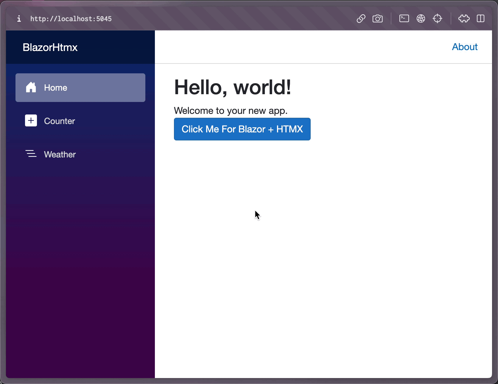

# Using HTMX with ASP.NET Core Blazor

With the release of .NET 8, developers now have access to multiple rendering modes. One of those rendering modes is Static Server Rendering. This means you can render Blazor pages with component hierarchies as plain-old HTML pages.

There was also a concept of "enhanced page loads" added, which means as you navigate between pages, the response is processed into the existing page, reducing unnecessary network request for CSS, JavaScript, and other assets in the app shell part of your application.

Finally, there is a new `RazorComponentResult<T>` that allows any ASP.NET Core endpoint (Minimal API, Razor Pages, or MVC) to return a rendered Blazor component.

We can put all these pieces together to allow for HTMX support in a Blazor application.

Follow the steps below:

## Step 1. Update App.Razor with Resources

I updated the `App.Razor` file to include the HTMX script, along with a necessary 
JavaScript implementation that you'll see later.

```html
<!DOCTYPE html>
<html lang="en">

<head>
    <meta charset="utf-8"/>
    <meta name="viewport" content="width=device-width, initial-scale=1.0"/>
    <base href="/"/>
    <link rel="stylesheet" href="bootstrap/bootstrap.min.css"/>
    <link rel="stylesheet" href="app.css"/>
    <link rel="stylesheet" href="BlazorHtmx.styles.css"/>
    <link rel="icon" type="image/png" href="favicon.png"/>

    <script defer src="_framework/blazor.web.js"></script>
    <script defer src="https://unpkg.com/htmx.org@1.9.8"></script>
    <script defer src="js/htmx-blazor.js"></script>
    <HeadOutlet/>
</head>
<body>
<Routes/>
</body>
</html>
```

## Step 2. Hook into `enhancedload` event

So remember when I said Enhanced Loading was a thing? Well, it is! This means that we need to reprocess any HTML that comes over the wire with HTMX for it to work. This is because enhanced load skips the lifecycle events that HTMX might be looking for, like `document load`.

Let's implement the `htmx-blazor.js` file.

```javascript
// An enhanced load allows users to navigate between different pages
window.Blazor.addEventListener("enhancedload", function () {
    // HTMX need to reprocess any htmx tags because of enhanced loading
    window.htmx.process(document.body);
});
```

## Step 3. Implement a component and endpoint

Let's add a component that we'll render as a fragment. In `Shared/LoveHtmx.razor` add the following HTML.

```html
<div class="alert alert-info">
    <span class="text-lg-center">
        I ❤️ HTMX
    </span>
</div>
```

I know it's nothing fancy, but it gets the point across. Let's render it via an endpoint now. I'm using a Minimal API endpoint registration.

```c#
app.MapGet("/love-htmx", 
    () => new RazorComponentResult<LoveHtmx>());
```

## Step 4. Invoking the Component Endpoint

We need to wire up HTMX at this point, and that's easy. In `Pages/Home.razor` add the following HTML.

```razor
@page "/"

<PageTitle>Home</PageTitle>

<h1>Hello, world!</h1>

Welcome to your new app.

<div>
    <button class="btn btn-primary"
            hx-swap="outerHTML"
            hx-get="/love-htmx">
        Click Me For Blazor + HTMX
    </button>
</div>
```

## Step 5. Run it!

You can see the image below that we can both invoke HTMX, navigate away and back, and invoke it again. Sweet!



Another example of the Counter.

<video src="sample-video.mp4"></video>

## Conclusion

It's possible to use HTMX with Blazor components, you just need to be aware of the Blazor lifecycle events and must reprocess HTMX between enhanced page loads. 

Cheers 🍻